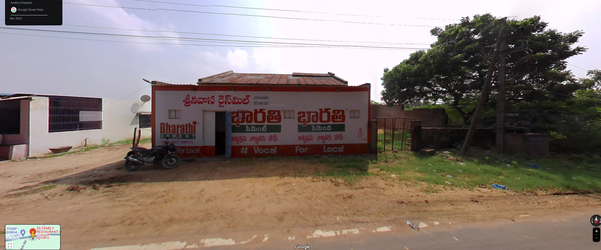
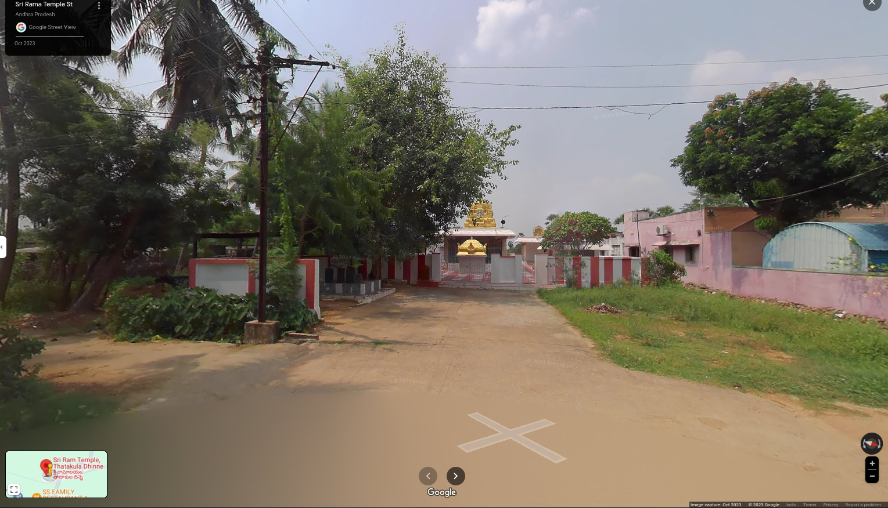
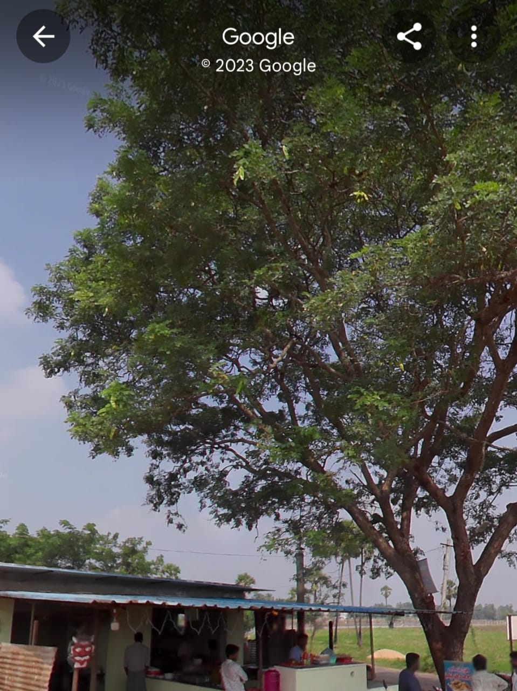

# Places Around Me
## AIM:
To develop a website to display details about the places around my house.
## Design Steps:
### Step 1:
Get the correct commands.
### Step 2:
The program should be executed successfully.
## Code:
```
map.html
<!DOCTYPE html>
<html>
    <head>
        <title>
            imagemaps demo
        </title>
    </head>
    <body>
        <h1>imagemaps demo</h1>
        
<map name="image_map">
    <area alt="ssfamilyrestaurant" title="ssfamilyrestaurant" href="ssfamilyrestaurant.html" coords="34,598,166,664" shape="rect">
    <area alt="sriramtemple" title="sriramtemple" href="sriramtemple.html" coords="191,118,95" shape="circle">
    <area alt="balaramkrishnantiffincenter" title="balaramkrishnantiffincenter" href="balaramkrishnantiffincenter.html" coords="317,477,93" shape="circle">
    <area alt="tatakuladinnie" title="tatakuladinnie" href="tatakuladinnie.html" coords="509,87,75" shape="circle">
    <area alt="bucchiootukururoad" title="bucchiootukururoad" href="bucchiootukururoad.html" coords="903,513,80" shape="circle">
</map>
  </body>
</html>
ssfamilyrestaurant.html
<!DOCTYPE html>
<html>
    <head>
        <title>
            ssfamilyrestaurant
        </title>
        <body>
            <h1>ssfamilyrestaurant</h1>
        </body>
    </head>
</html>

sriramtemple.html<!DOCTYPE html>
<html>
    <head>
        <title>
            sriramtemple
        </title>
        <body>
            <h1>sriramtemple</h1>
        </body>
    </head>
</html>
tatakuladinnie.html
<!DOCTYPE html>
<html>
    <head>
        <title>
            tatakuladinnie
        </title>
        <body>
            <h1>tatakuladinnie</h1>
        </body>
    </head>
</html>
bucchiootukururoad
<!DOCTYPE html>
<html>
    <head>
        <title>
            bucchiootukururoad
        </title>
        <body>
            <h1>bucchiootukururoad</h1>
        </body>
    </head>
</html>
balaramakrishnantiffincenter.html
<!DOCTYPE html>
<html>
    <head>
        <title>
            balaramkrishnantiffincenter
        </title>
        <body>
            <h1>balaramkrishnantiffincenter</h1>
        </body>
    </head>
</html>
```
## Output:
HOMETOWN

ssfamilyrestaurant:

sriramtemple:

bucchiootukururoad:

balaramakrishnantiffincenter:


## Result:
Thus the program executed successfully.
