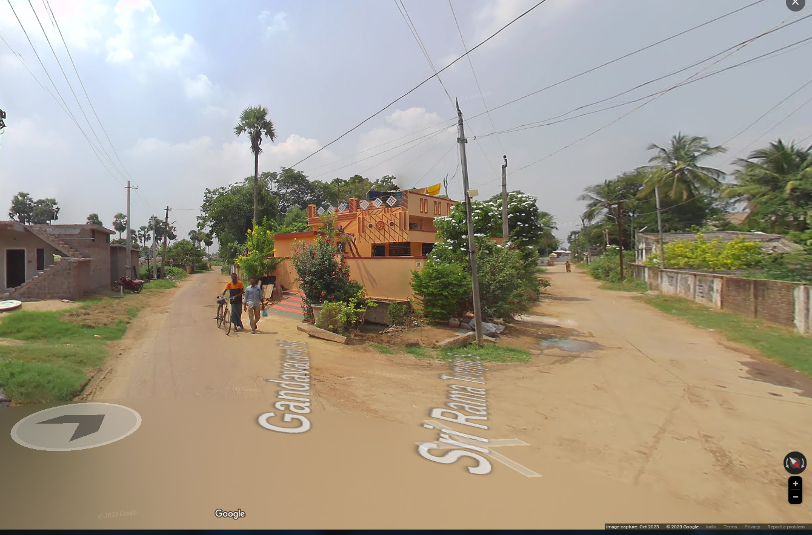

# Places Around Me
## AIM:
To develop a website to display details about the places around my house.

## Design Steps:

### Step 1:
Get the correct commands.
### Step 2:
The program should be executed successfully.
## Code:

## Output:

HOMETOWN

Five places near hometown:

ssfamilyrestaurant:

sriramtemple:

bucchiootukururoad:

balaramakrishnantiffincenter:

tatakuladinnie:

## Result:
Thus the program executed successfully.
